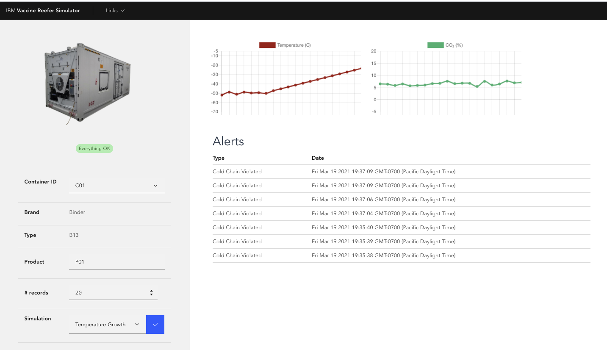

# Vaccine Freezer manager service

This is a basic Quarkus - reactive messaging app to listen to Alerts on freezer and also manage the life cycle of each freezer devices. This is to complete the Cold Chain or order management use cases of the [vaccine solution demo](https://ibm-cloud-architecture.github.io/vaccine-solution-main/).

## Running the application in dev mode

* To run locally in dev mode, you need to start the Kafka and Zookeeper so the app can connect to Kafka.  

```shell
docker-compose up -d
```

* Create the needed topics: `./scripts/createTopics.sh ` and list those topics: `./scripts/listTopics.sh `

```
vaccine.reeferAlerts
vaccine.reefers
```

You can then run the application in dev mode that enables live coding using:

```shell script
./mvnw compile quarkus:dev
```

> **_NOTE:_**  Quarkus now ships with a Dev UI, which is available in dev mode only at http://localhost:8080/q/dev/.

## Running the app with other components

The Reefer simulator needs to access the Freezer-mgr service via socket to get server side events for the alerts. 

The docker compose includes the simulator 'service', so to demonstrate the integration do the following steps:

* To be able to connect to the docker network, and still doing remote-dev mode with quarkus, we need to build a special docker image and start it being connected to the network:

```shell
mvn package -Dquarkus.package.type=mutable-jar
docker build -f src/main/docker/Dockerfile.dev -t ibmcase/freezer-mgr-dev .
docker run -p 8080:8080 --network vaccine-freezer-mgr_default ibmcase/freezer-mgr-dev:latest
```

* Verify the freezer manager app runs well, using the following: 

```shell
curl -X GET "http://localhost:8080/reefers" -H  "accept: application/json"
```
you should get some freezer container.

* Point a web browser to the simulator UI:  [http://localhost:5000/#/](http://localhost:5000/#/)
* Select one of the container to reach main container view (Use container id: C01)
* Run a temperature growth simulation on C01 for product P01 for 30 to 80 records. You should see the gauges changing over time.
* Under the Freezer project, create one or two alert events using the following tool: `./scripts/sendReeferAlerts.sh `, then under the '>' prompt enter:

```json
{"containerID": "C01","type": "Cold Chain Violated"}
```

* Verify the events are in the topic: ` ./scripts/verifyReeferAlertsTopicContent.sh `
* The Alerts table, in the "reefer simulator" should be updated with the new created alerts.



## Packaging and running the application

The application can be packaged using:

```shell script
./mvnw package 
```

It produces the `quarkus-run.jar` file in the `target/quarkus-app/` directory and a set of openshift / kubernetes manifests.

The application is now runnable using `java -jar target/quarkus-app/quarkus-run.jar`.

## Git Action

The .github folder has a git Action workflow to build the image and push to your selected registry. You need to define the following github secrets to make it working: For DOCKER_REGISTRY we are using `quay.io` and `ibmcase` DOCKER_REPOSITORY.

```shell
DOCKER_USERNAME 
DOCKER_PASSWORD
DOCKER_REPOSITORY 
DOCKER_IMAGE_NAME 
DOCKER_REGISTRY
```

Which means a docker image is already available for you to use if you want to deploy to OpenShift directly.

## Deploy to OpenShift

Once logged to the cluster, use the [vaccine-gitops repository](https://github.com/ibm-cloud-architecture/vaccine-gitops).
The `quay.io` registry has the last up to date version of the [docker image under the ibmcase](https://quay.io/repository/ibmcase/vaccine-freezer-mgr) account.

```shell
oc apply -k apps/freezer-mgr
```

## Creating a native executable

You can create a native executable using: 

```shell script
./mvnw package -Pnative
```

Or, if you don't have GraalVM installed, you can run the native executable build in a container using: 
```shell script
./mvnw package -Pnative -Dquarkus.native.container-build=true
```

You can then execute your native executable with: `./target/vaccine-reefer-mgr-1.0.0-SNAPSHOT-runner`

If you want to learn more about building native executables, please consult https://quarkus.io/guides/maven-tooling.html.
